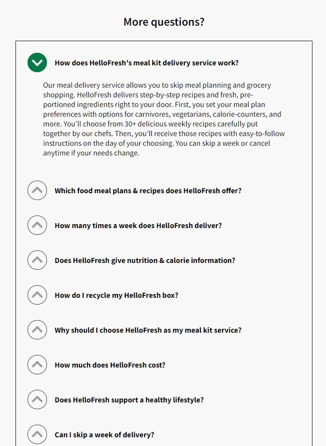

# Procesverslag

Markdown is een simpele manier om HTML te schrijven.  
Markdown cheat cheet: [Hulp bij het schrijven van Markdown](https://github.com/adam-p/markdown-here/wiki/Markdown-Cheatsheet).

Nb. De standaardstructuur en de spartaanse opmaak van de README.md zijn helemaal prima. Het gaat om de inhoud van je procesverslag. Besteedt de tijd voor pracht en praal aan je website.

Nb. Door _open_ toe te voegen aan een _details_ element kun je deze standaard open zetten. Fijn om dat steeds voor de relevante stuk(ken) te doen.

## Jij

  
uitwerken voor kick-off werkgroep

### Auteur:

Steven Wan

#### Je startniveau:

Rood

#### Je focus:

responsive

## Je website

  
uitwerken voor kick-off werkgroep

### Je opdracht:

link naar de website die je gaat namaken óf de naam/omschrijving van je eigen ontwerp
https://www.hellofresh.com/#question-US-homepage-FAQ-How-many-times-a-week-does-HelloFresh-deliver?-2

#### Screenshot(s) van de eerste pagina (small screen):

homepagina
  

#### Screenshot(s) van de tweede pagina (small screen):

our plan pagina
  

## Toegankelijkheidstest 1/2 (week 1)

  
uitwerken na test in 1e werkgroep

### Bevindingen

Lijst met je bevindingen die in de test naar voren kwamen:
Je kan niet terug via 'our plan' pagina
Central field loss:
view our plans hover onduidelijk
kan niks lezen
laag contrast
ziet geen outline buttons
ziet geen stappenplan (weinig contrast)
'First box total' balk onduidelijk, te weining contrast
Parkinson:
knoppen zijn erg klein
colorblind:
foto's niet duidelijk
hover kan duidelijker

#### Screenreader

Hij gaat niet van zelf langs de FAQ

#### Muis en Toetsenbord

Muis only:
Geen probleem

Toetsenbord only:
Gaat langs de tabben van menu ondanks het menu gesloten is

#### Motoriek (shocks, elastiekjes)

Buttons zijn relatief klein voor motorieke beperkingen
  
  oplossing: De buttons vergroten

#### Visueel (brillen, contrast, kleurenblind, dark/light).

De hover van de buttons hebben een laag contrast waardoor het moeilijk is om waar te nemen
  
  oplossing: hover contrast verhogen

## Breakdownschets (week 1)

  
uitwerken na afloop 2e werkgroep

### de hele pagina:

  
    
    
    

### dynamisch deel (bijv menu):

## Voortgang 1 (week 2)

  
uitwerken voor 1e voortgang

### Stand van zaken

  Ik heb een overzicht gemaakt van welke stukken van de website ik wel en niet ga coderen. Verder heb ik een begin gemaakt aan de HTML code. Hier ga ik alle content erin verwerken waarmee ik later met CSS verder ga stylen. Hier had ik tot nu toe niet echt moeite mee.
  
      
  
      
  
        

### Agenda voor meeting

samen met je groepje opstellen

Fee: 
1. Ik moet nog alles in html zetten, tekst+plaatjes
2. Nog meer oefenen
3. Vragen stellen in de les
  
Mila:
1. Basis structuur maken
2.Inhoud verzamelen(afbeedlingen, iconen, fonts)
3.Bronnen niet vergeten
4.CSS
  

### Verslag van meeting

hier na afloop snel de uitkomsten van de meeting vastleggen

- HTML code afronden
- Een begin maken aan CSS
- Loop beetje achter
- bling bling ideeën bedenken

## Voortgang 2 (week 3)

  
uitwerken voor 2e voortgang

### Stand van zaken

Heb een begin kunnen maken aan de header en eerste sections, ik kon de achtergrond afbeelding niet goed positioneren. Ik moet de header nog verbeteren.

### Agenda voor meeting

samen met je groepje opstellen

Mila: opgegeven :(
Fee: Heeft veel moeite met HTML
### Verslag van meeting

hier na afloop snel de uitkomsten van de meeting vastleggen

- Verder werken aan CSS
- Begin maken aan JS
- Absolute position gebruiken voor achtergrond img

## Toegankelijkheidstest 2/2 (week 4)

  
uitwerken na test in 8e werkgroep

### Bevindingen

Lijst met je bevindingen die in de test naar voren kwamen (geef ook aan wat er verbeterd is):

#### Screenreader

Een manier bedenken om navigatie te sluiten
"inert" gebruiken om navigatie te skippen indien het niet open is

#### Muis en Toetsenbord

Muis only: niks aan de hand
Toetsenbord: manier bedenken om nav te sluiten

#### Motoriek (shocks, elastiekjes)

De buttons groter maken 

#### Visueel (brillen, contrast, kleurenblind, dark/light).

Meer contrast in de hover op de buttons

## Voortgang 3 (week 4)

  
uitwerken voor 3e voortgang

### Stand van zaken
  
Ik ben bijna klaar met de lay-out van de homepagina. Ik moet nog wel de bovenstaande verbeterpunten in de homgepagina verwerken. De plannenpagina moet ik nog uitwerken.

### Agenda voor meeting

samen met je groepje opstellen

Bespreken welke elementen ik kan toevoegen om mijn website meer toegankelijk te maken.
  
### Verslag van meeting

hier na afloop snel de uitkomsten van de meeting vastleggen

- Heb geleerd hoe je animaties kan maken met css samen met Danian
- Heb een terugknop geplaatst in de plannen pagina

## Eindgesprek (week 5)

  
uitwerken voor eindgesprek

### Je uitkomst - karakteristiek screenshots:

  
  
  
  

### Dit ging goed/Heb ik geleerd:
  
-Ik heb geleerd hoe je een slide-menu kan maken met behulp van JS
-Ik heb geleerd hoe je animaties kan maken
- Ik heb geleerd hoe je rekening kan houden met mensen die een visuele/motoriek beperking hebben
- ik ben beter geworden in HTML, CSS en JS
Korte omschrijving met plaatjes

  
  Ik ben vooral trots op de ingredienten selector in de plannenpagina. Ik vind dat mijn pagina in het geheel erg professioneel uitziet vergeleken met mijn voorgaande codeer-pagina's. Ik heb gemerkt dat ik tijdens dit vak grote vooruitgang stappen heb gezet in coderen. Ik merk dat ik coderen steeds meer begrijp waardoor ik het persoonlijk steeds leuker begin te vinden :)

### Dit was lastig/Is niet gelukt:
  
De officiele plannenpagina bestaat uit meerdere stappen. Ik kwam er niet aan toe om het volledig uit te werken.
Ik kwam erachter dat mijn html-code niet volledig screenread-vriendelijk is. Ik heb checkmark emoji's gebruikt waardoor de screenreader die volledig hardop leest, wat niet de bedoeling is. Bij sommige gedeelte heb ik eerst de  gecodeerd en daarna pas de content. Deze volgorde moet worden omgedraaid omdat de content belangrijker is.
  
Korte omschrijving met plaatjes
  
  
  
    

## Bronnenlijst

  
continu bijhouden terwijl je werkt

Carrousel:(https://codepen.io/shooft/pen/yLKjzWa)
Checkboxes: https://codepen.io/shooft/pen/QWxegaJ
https://www.a11yproject.com/posts/how-to-hide-content/

